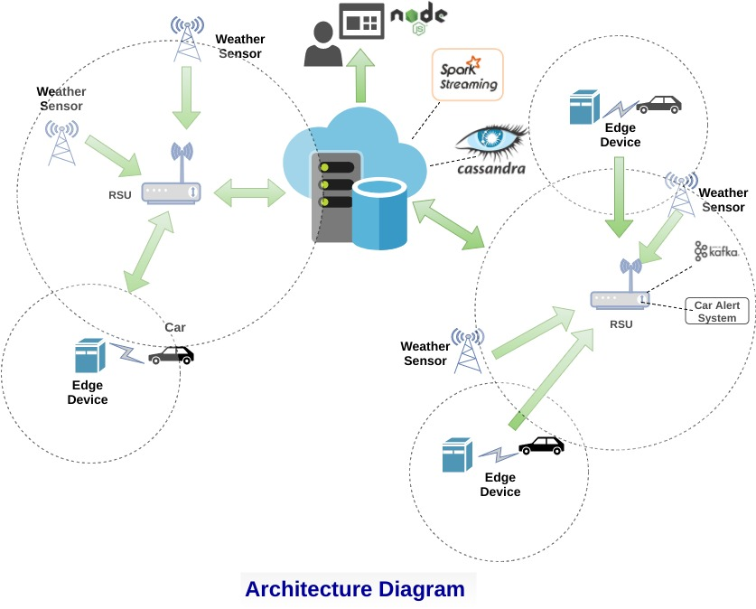

# Hazardous Weather Alert System Using IOT and Edge Computing

## Goal
Demonstrating the usage of Spark and Messaging systems like Kafka to analyze IOT data patterns and provide real-time hazardous weather alerts in a connected car ecosystem

## Data Sources
* Vehicle Data from cars
* Weather data from sensors

## Use Cases
* Push hyper local weather updates to cars in sensor's range
* Alert cars about hazardous weather
* Track and aggregate car activity in order to help insurance companies make the correct decision in event of an accident

## Hazardous Weather Conditions
* Blizzard conditions
* Wind Advisory
* Fog Advisory

## Rules for Hazardous Weather Detection
* Blizzards - windSpeed > 35 mph and Visibility < quarter mile and Precipitation = snow and timeElapsed > 2 hrs
* Wind Advisory - windSpeed > 40 mph and timeElapsed > 2 hrs
* Fog - Visibility < 2 miles and timeElapsed > 1 hrs

## Architecture Diagram


## Architectural Components
* <b>Data Sources (Connected Car and Weather Sensor)</b>
    * Connected car publishes car coordinates, speed, route and destination to the RSU
    * Weather sensor publishes temperature, visibility, precipitation, wind speed to the RSU
    * Hazardous Weather alerts are published by  cloud (Spark)
* <b>Cloud Processing Engine (Spark)</b>
    * Spark is the consumer of car and weather data
* <b>Edge Devices (Connected car, Weather sensor, RSU)</b>
    * RSU is a edge device that has both thin client and fat client capabilities.
    * Cars and weather sensors have limited capabilities and can only send data to RSU
    * Car connects with the RSU within its range and is alerted about hazardous weather
    
## Communication Protocol Between Car and RSU
* The mode of communication will be <b>TCP</b> as the connection has to stay active to send updates back to car
* The car has the <b>list of known hosts</b> it can connect to once it is started
* The sensor has a limited connection pool i.e at any instance the sensor can only be connected to limited number of cars

## Communication Between Between Weather sensor and RSU

## Communication Protocol Between RSU and Spark

## Data Model
### Car Data
```
public class CarData implements Serializable {
    private String type;
    private String uuid;
    private String latitude;
    private String longitude;
    private Long timestamp;
    private double speed;
    private double fuelLevel;
}
```
### Weather Data
```
public class WeatherData implements Serializable {
    private String sensorId;
    private double latitude;
    private double longitude;
    private Long timestamp;
    private double temperature;
    private Precipitation preciptation;
    private double windSpeed;
    private double visibility;
}

public enum Precipitation {
    RAIN,
    SNOW,
    HAIL,
    NORMAL
}
```
### Hazardous Weather Notification Data
```
public class WeatherNotificationData implements Serializable {
    private String type;
    private String sensorId;
    private Double latitude;
    private Double longitude;
    private Double temperature;
    private Double windspeed;
    private Double visibility;
    private String weatherAlert;
}
```
## TODO
* Run analytics on top of cassandra through RESTFUL service and webUI

